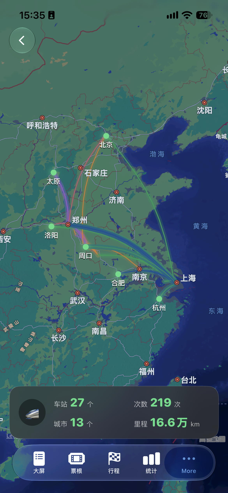
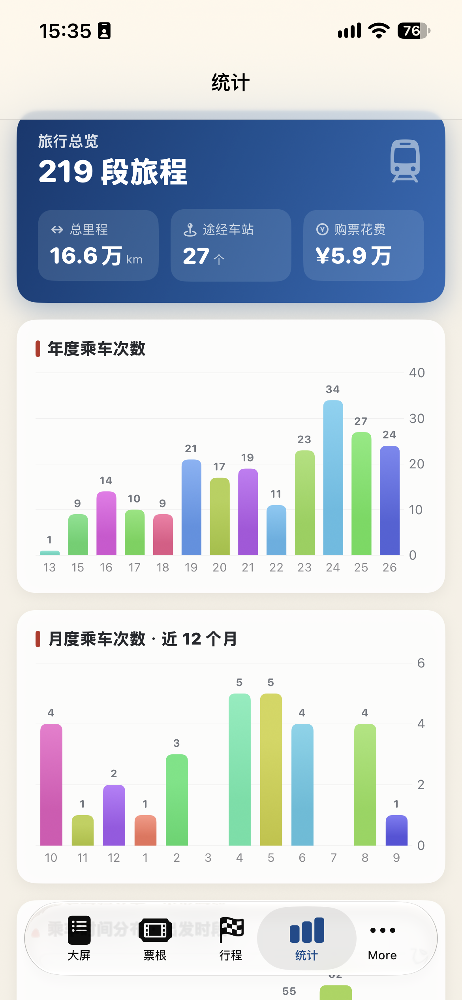
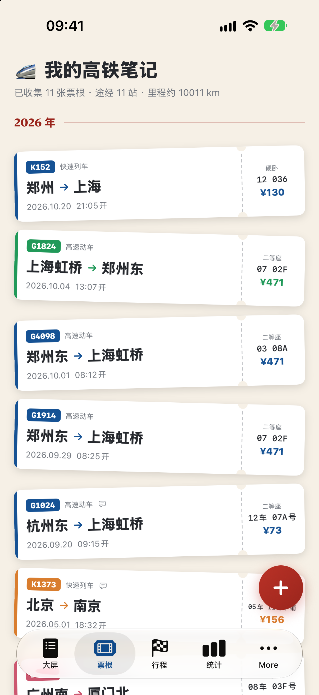
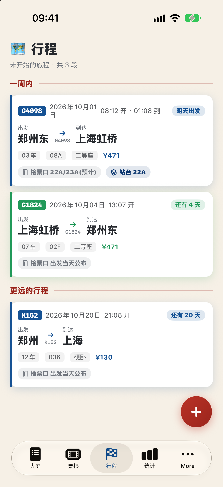
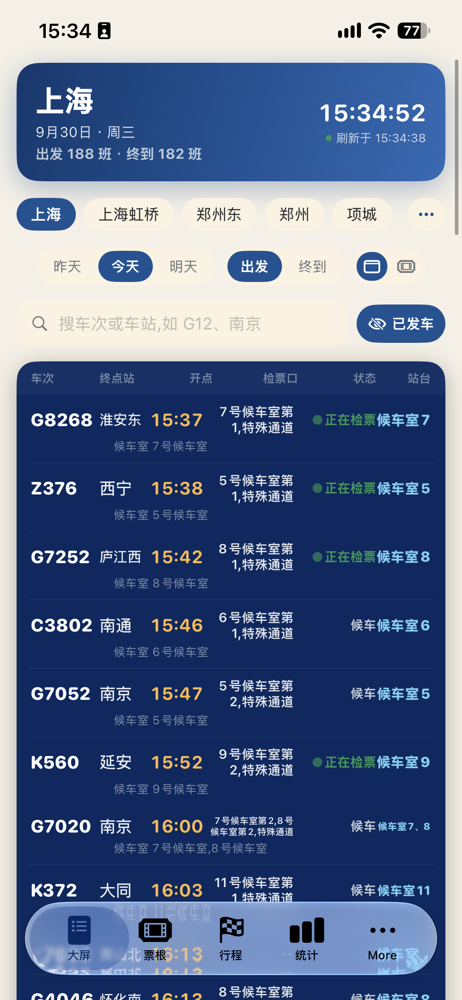

# 高铁笔记 (TravelNotes)

> 每张车票 = 一页日记。iOS 原生个人 App:SwiftUI + SwiftData,无第三方依赖、无后端,数据全存手机本地。

   

<p align="center">
  
  
  <br/>
  
  
  
</p>

## English

TravelNotes is a native iOS personal app that turns every train ticket into a diary page. Pure SwiftUI + SwiftData, zero third-party dependencies, no backend — all data stays on your phone. It auto-syncs 12306 confirmation emails over IMAP, draws retro ticket artworks, renders your travel footprint on a dark map, shows a live station departure board, and charts 13 years of journeys.

产品与视觉设计见 [DESIGN.md](DESIGN.md)。

## 功能

- 首页「票根收藏册」:按年份分组的车票时间线,顶部统计(票根数 / 途经车站 / 里程估算)
- 「足迹」页:暗色地图上用发光弧线连起所有行程,车站发光点 + 城市名标注,
  底部深色统计卡(车站 / 次数 / 城市 / 里程),风格参考航旅纵横足迹页
- 「大屏」:车站实时站牌,出发/终到班次、检票口、站台与候车状态一目了然,
  支持多车站收藏切换、按昨天/今天/明天筛选、搜车次或车站
- 「行程」页:未开始的旅程卡片(检票口/站台预测、发车倒计时),一周内 / 更远的行程分组
- 「同步」页:QQ 邮箱 IMAP 全自动同步订票邮件(12306):
  - 填一次邮箱 + 授权码(存本机钥匙串,不上传),之后打开 App 自动增量同步
  - 解析出的候选票根需要你点开确认后才会入库(日期/车次/区间/席别/票价自动识别)
  - 自动跳过退票/退单邮件;同一车次+区间+日期去重;支持 UTF-8/GBK、base64/QP 编码
- 「统计」页:总览(次数/里程/车站/花费)、年度乘车趋势图、常走线路 TOP5、到访城市 TOP5、
  车型/席别分布、之最(最贵一张/单程最远/最早一张),Swift Charts 原生绘制
- 记一笔:日期 + 站名(内置 ~190 站自动补全)必填,车次/车厢/座位/席别/票价/时刻可选
- 车票票面纯代码绘制,两套皮肤:复古红软纸票 / 蓝色磁卡票,表单里实时预览
- 每条行程可写日记 + 从相册选照片(自动压缩到最长边 1600px 存沙盒)
- 详情页:全尺寸票面 + 日记 + 照片九宫格(全屏浏览、双指缩放、双击放大)

## 用 Xcode 跑起来

```bash
open TravelNotes.xcodeproj
```

1. 选中 TravelNotes target → **Signing & Capabilities** → Team 选择你的 Apple ID
   (没有就 Xcode → Settings → Accounts → 左下角 + 添加,免费个人账号即可)
2. 顶部设备选择:模拟器(如 iPhone 18 Pro)或插上数据线选你的 iPhone
3. ⌘R 运行

### 真机(自己的 iPhone)

- iPhone 需开启开发者模式:设置 → 隐私与安全性 → 开发者模式(需重启手机)
- 首次安装后需信任证书:设置 → 通用 → VPN与设备管理 → 信任你的开发者证书
- 免费 Apple ID 限制:签名 7 天有效,过期重新 ⌘R 安装即可;每台设备最多 3 个免费签名 App

## 工程说明

- `project.yml`:XcodeGen 工程定义。改了工程结构(增删文件不用,增删 target/设置才要)后执行
  `~/development/bin/xcodegen generate`(xcodegen 装在 `~/development/bin`)
- `TravelNotes/Models/TicketEntry.swift`:SwiftData 数据模型;`MailCandidate.swift`:邮件候选票根
- `TravelNotes/Services/IMAPClient.swift`:极简 IMAP 客户端(Network.framework,含 QQ 邮箱要求的 ID 命令)
- `TravelNotes/Services/MIME.swift`:MIME 解码(折叠头/base64/QP/UTF-8与GBK);`TicketMailParser.swift`:12306 邮件解析
- `TravelNotes/Services/MailSyncEngine.swift`:同步引擎(增量、去重、批量 FETCH)
- `TravelNotes/Views/FootprintView.swift`:足迹地图;`Views/TicketViews.swift`:红/蓝票面,全部矢量绘制
- 数据备份:直接拷贝 App 沙盒 `Documents/`(sqlite + Photos 文件夹)
- 调试参数:启动参数加 `-UITestSeed` 注入演示数据;`-BoardTab`/`-HomeTab`/`-TripTab`/`-StatsTab`/
  `-FootprintTab`/`-SyncTab` 直达对应 Tab;`-MailUser x -MailPass y` 预置邮箱账号并触发同步;
  `-MailSyncTest` 走自检流程输出到 /tmp/tn_sync.txt
